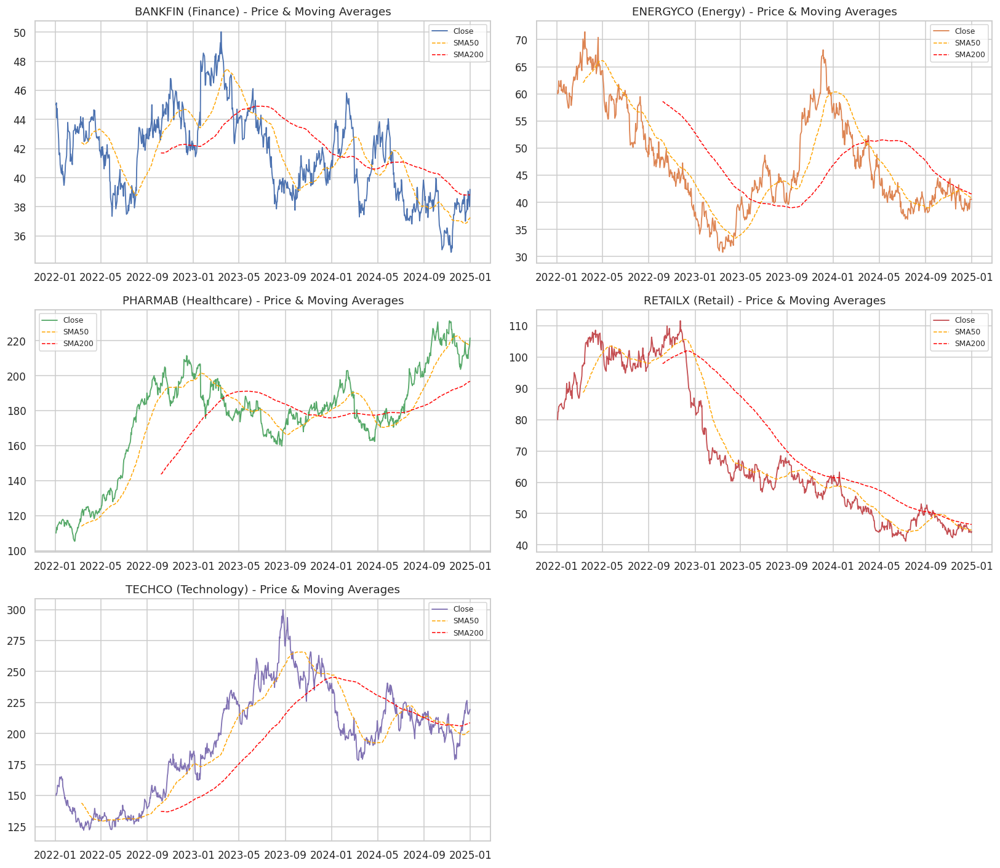
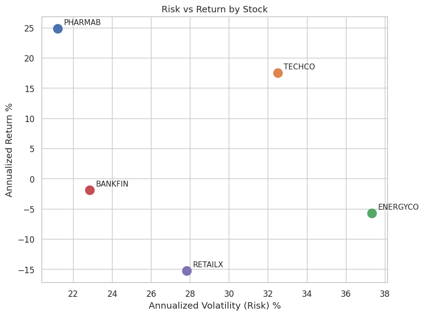

# 📈 Stock Market Trend Analysis

A complete data analysis project examining price trends, volatility, and risk-adjusted returns across a 5-stock watchlist spanning Technology, Retail, Energy, Finance, and Healthcare — using Python, Pandas, and technical analysis indicators.

## 🎯 Business Problem

An investor wants to know:
1. How has each stock trended over the last 3 years — up, down, or sideways?
2. Which stock gives the best return *for the risk taken* (not just the highest raw return)?
3. How volatile is each stock, and how correlated are their movements?
4. What do current technical signals (RSI, MACD, Bollinger Bands) suggest right now?

## 🔑 Key Findings

| Stock | Sector | Total Return (3yr) | Sharpe Ratio | Max Drawdown | Current Trend |
|---|---|---|---|---|---|
| **PHARMAB** | Healthcare | **+101.4%** | **0.94** | -24.5% | Strong Uptrend |
| TECHCO | Technology | +46.3% | 0.39 | -40.5% | Sideways |
| BANKFIN | Finance | -12.9% | -0.30 | -30.3% | Sideways |
| ENERGYCO | Energy | -32.4% | -0.29 | -56.9% | Strong Downtrend |
| RETAILX | Retail | -44.7% | -0.73 | -63.2% | Strong Downtrend |

- **PHARMAB was the standout** — best absolute *and* risk-adjusted return, with the shallowest drawdown among gainers, and it's currently in a confirmed uptrend.
- **TECHCO's returns came with a much bumpier ride** — 32% annualized volatility vs. PHARMAB's 21% for a lower total return.
- **RETAILX and ENERGYCO underperformed on every metric**, both currently in confirmed downtrends with the two deepest drawdowns (-63% and -57%).
- **Cross-sector correlation was low-to-moderate**, meaning a portfolio spread across these sectors would have diversified risk meaningfully better than concentrating in one.

*(See the full notebook for charts and detailed reasoning behind each finding.)*

## 🛠️ Tools & Techniques

- **Python** — Pandas, NumPy for data manipulation
- **Matplotlib / Seaborn** — visualization
- **Technical indicators implemented from scratch:** SMA (20/50/200), EMA, RSI (14), MACD, Bollinger Bands
- **Risk metrics:** annualized return & volatility, Sharpe Ratio, max drawdown
- **Statistical analysis:** correlation matrix of daily returns across stocks
- **Rule-based trend classification** using moving-average crossovers (Golden Cross / Death Cross logic)

## 📁 Repository Structure

```
stock-market-trend-analysis/
├── stock_market_trend_analysis.ipynb   # Main notebook — start here
├── generate_data.py                    # Generates the dataset (see note below)
├── run_analysis.py                     # Standalone script version of the full pipeline
├── requirements.txt
├── data/
│   ├── stock_prices_raw.csv                    # Raw input data
│   ├── stock_prices_clean_with_indicators.csv  # Cleaned data + all computed indicators
│   ├── risk_return_summary.csv                 # Final risk/return metrics table
│   └── trend_classification.csv                # Current trend per stock
└── charts/                             # All exported chart images (PNG)
```

## 📊 Sample Output

**Price trends with moving averages:**



**Risk vs. Return:**



## 📌 Note on the Dataset

This project is written to run identically on **real market data**. To use live data instead of the bundled dataset, install `yfinance` and run:

```python
import yfinance as yf
df = yf.download(["AAPL", "MSFT", "AMZN", "JNJ", "XOM"], start="2022-01-01", end="2024-12-31")
```

then save it in the same schema as `data/stock_prices_raw.csv` (`Date, Ticker, Open, High, Low, Close, Adj Close, Volume`). The current bundled dataset was generated using `generate_data.py`, which simulates realistic price paths (Geometric Brownian Motion, calibrated per-sector drift/volatility, with injected market-shock events and realistic data-quality issues like missing values and duplicate rows) — this was necessary because the environment this was built in doesn't have live access to financial data APIs. All cleaning and analysis logic is fully source-agnostic.

## 🚀 How to Run

```bash
git clone <your-repo-url>
cd stock-market-trend-analysis
pip install -r requirements.txt

# Regenerate the dataset (optional — a copy is already included in /data)
python generate_data.py

# Run the full analysis as a script (produces charts + CSV outputs)
python run_analysis.py

# OR explore interactively
jupyter notebook stock_market_trend_analysis.ipynb
```

## 📈 Possible Extensions

- Add a price-prediction model (ARIMA, Prophet, or LSTM) for forward-looking forecasts
- Backtest a simple moving-average crossover trading strategy against buy-and-hold
- Pull in real-time data via `yfinance` and schedule daily indicator updates
- Build an interactive Power BI/Streamlit dashboard on top of the indicator dataset

---

*This analysis is for educational and portfolio purposes only and does not constitute financial advice.*
